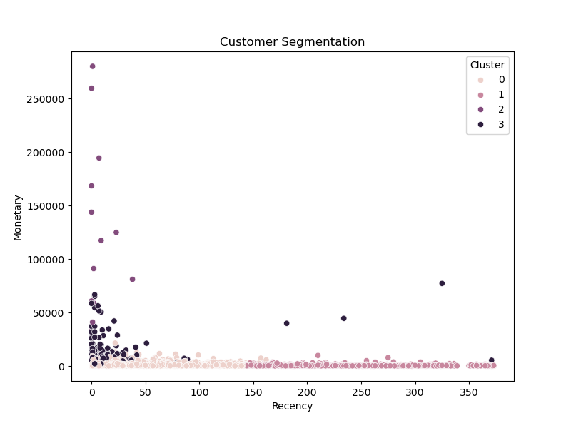

# 🛍️ Customer Segmentation using RFM Analysis and K-Means

## 📌 Project Overview
This project performs customer segmentation using RFM (Recency, Frequency, Monetary) analysis and K-Means clustering to identify different types of customers based on their purchasing behavior.

## 📊 Dataset
Online Retail dataset containing transactional data of a UK-based e-commerce store.

## 🧹 Data Cleaning
- Removed missing CustomerID values
- Removed cancelled transactions
- Filtered invalid quantities and prices
- Created Sales column

## 📊 RFM Analysis
- Recency → Last purchase
- Frequency → Number of purchases
- Monetary → Total spending

## ⚙️ Model Used
- K-Means Clustering
- StandardScaler for feature scaling
- Elbow Method for optimal clusters

## 📊 Visualization
Customer segmentation visualized using scatter plots.

## 📊 Key Insights
- Identified high-value (VIP) customers
- Found loyal customers with frequent purchases
- Detected at-risk customers with low activity
- Segmented customers for targeted marketing

## 🛠️ Tools Used
- Python
- Pandas
- NumPy
- Matplotlib
- Seaborn
- Scikit-learn

## 🚀 Conclusion
This project demonstrates how data-driven customer segmentation can improve business decision-making.

